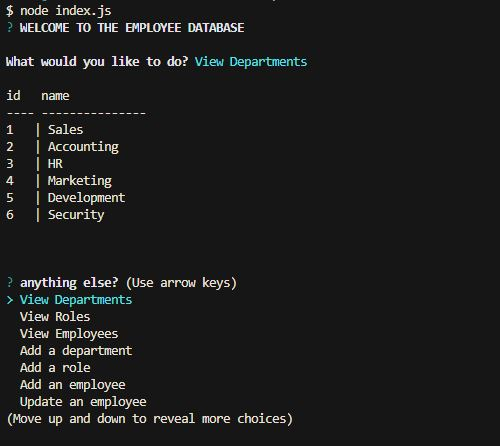

# database-editor

## Description

This application is built to display, create, and update information in an employee database. the functions are:

1. View Departments: view all deparmtnets in the company.
2. View Roles: View all job roles with their salary and department
3. View Employees: View all company employees with their role, their department, their salary, and their manager
4. Add a department: adda new department to the company
5. Add a role: Add a new job role to the company
6. Add an employee: Add a new employee to the company.
7. Update an employee: update an employee's role and manager.
8. Quit: leave the application

## Links

Github Repo: https://github.com/aalyman42/database-editor

Video tutorial: https://drive.google.com/file/d/1w4aS87p5QXfTyVcJaJnFko8LUGgTXpbP/view?usp=sharing

## Screenshot

## Tutorial

1. install dependencies
2. input your own mysql credentials in queries.js
3. run:
   > node index.js
